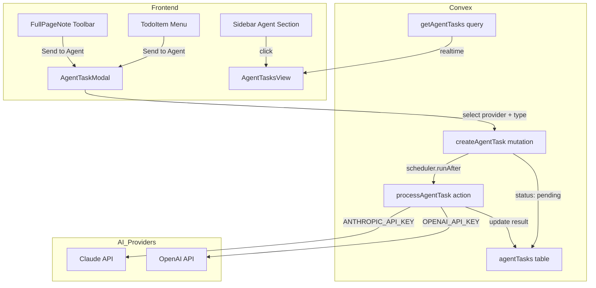

# AI Agent Tasks Feature

## Overview

Add "Send to Agent" functionality from todos (via menu) and full-page notes (via toolbar) that processes content in the background using Claude or OpenAI. Results appear in a new "Agent Tasks" section with dedicated UI similar to full-page notes.

## Architecture



## Database Schema

Add new `agentTasks` table to [convex/schema.ts](convex/schema.ts):

```typescript
agentTasks: defineTable({
  userId: v.string(),
  sourceId: v.string(), // todo._id or fullPageNote._id
  sourceType: v.union(v.literal("todo"), v.literal("fullPageNote")),
  sourceContent: v.string(),
  sourceTitle: v.optional(v.string()),
  provider: v.union(v.literal("claude"), v.literal("openai")),
  taskType: v.union(
    v.literal("expand"),
    v.literal("code"),
    v.literal("summarize"),
    v.literal("analyze"),
  ),
  status: v.union(
    v.literal("pending"),
    v.literal("processing"),
    v.literal("completed"),
    v.literal("failed"),
  ),
  result: v.optional(v.string()),
  error: v.optional(v.string()),
  folderId: v.optional(v.id("folders")),
  date: v.optional(v.string()),
})
  .index("by_user", ["userId"])
  .index("by_user_and_status", ["userId", "status"]);
```

## Backend Functions

### New File: `convex/agentTasks.ts`

Queries and mutations:

- `getAgentTasks` - Get all agent tasks for user (with status filter)
- `getAgentTaskCounts` - Get pending/completed counts for sidebar badges
- `createAgentTask` - Create task with status "pending", schedule processing
- `getAgentTask` - Get single task by ID
- `deleteAgentTask` - Delete a task

### New File: `convex/agentTaskActions.ts`

Actions for AI processing:

- `processAgentTask` - Main action that calls Claude or OpenAI based on provider
- Build system prompt based on taskType (expand, code, summarize, analyze)
- Update task status to "processing" then "completed" or "failed"
- Uses existing `ANTHROPIC_API_KEY` for Claude
- Requires new `OPENAI_API_KEY` for OpenAI

## Frontend Components

### New: `src/components/AgentTaskModal.tsx`

Modal for configuring agent task:

- Provider selector (Claude / OpenAI icons)
- Task type selector (Expand / Code / Summarize / Analyze)
- Preview of source content
- "Send to Agent" button
- Matches existing modal design (ConfirmDialog style)

### New: `src/components/AgentTasksView.tsx`

Dedicated view for agent task results:

- List of tasks with status indicators (pending spinner, completed check, failed X)
- Click task to view full result with markdown rendering
- Copy result button
- Delete task button
- Real-time updates via Convex subscription
- Matches full-page notes styling

### Modify: `src/components/TodoItem.tsx`

Add "Send to Agent" menu option:

- Add after "Start Pomodoro" in menu dropdown
- Triggers `onSendToAgent` callback with todo content
- Auth check before allowing action

### Modify: `src/components/FullPageNoteTabs.tsx`

Add "Send to Agent" button:

- New icon button in tab toolbar (Bot icon from lucide-react)
- Opens AgentTaskModal with note content
- Only visible for authenticated users

### Modify: `src/components/Sidebar.tsx`

Add "Agent Tasks" section:

- New collapsible section below dates
- Shows pending/completed count badges
- Click opens AgentTasksView
- Bot icon for section

### Modify: `src/App.tsx`

- Add `showAgentTasks` state
- Add `AgentTaskModal` state and handlers
- Add `AgentTasksView` rendering
- Pass `onSendToAgent` props to TodoList and FullPageNoteTabs

## Styles

Add to [src/styles/global.css](src/styles/global.css):

- Agent task modal styles
- Agent tasks view styles
- Status indicator styles (pending, processing, completed, failed)
- Provider and task type selector styles
- All styles theme-aware (dark, light, tan, cloud)

## Environment Variables

Requires:

- `ANTHROPIC_API_KEY` (existing)
- `OPENAI_API_KEY` (new, must be added to Convex dashboard)

## Task Types Behavior

- **Expand**: "Expand on this idea. Research, brainstorm, and create a detailed plan."
- **Code**: "Generate code to implement this. Include comments and explain your approach."
- **Summarize**: "Summarize and organize this content into clear, actionable points."
- **Analyze**: "Analyze this and provide feedback, suggestions, and potential improvements."